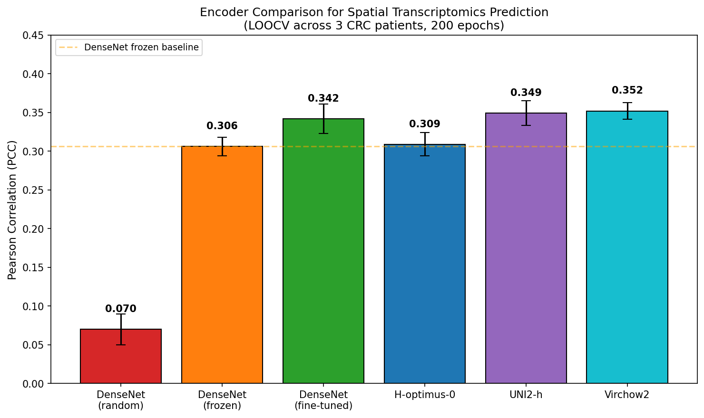

# Encoder Comparison for Spatial Transcriptomics Prediction

Benchmark comparing image encoders for predicting spatial gene expression from H&E histology images.

**Task**: Predict which genes are active and where, directly from tissue images.

**Why it matters**: Spatial transcriptomics is expensive. Predicting expression from standard histology could unlock molecular insights from millions of existing slides.

---

## How It Works

```
┌─────────────┐      ┌─────────────┐      ┌─────────────────────┐
│   H&E       │      │   Encoder   │      │      Decoder        │
│   Image     │ ──▶  │  (variable) │ ──▶  │  (Img2ST-Net UNet)  │
│  (448×448)  │      │             │      │                     │
└─────────────┘      └─────────────┘      └─────────────────────┘
                            │                       │
                     "What's in the         "Where are genes
                      tissue?"               expressed?"
```

- **Encoder**: Extracts visual features from the histology image. This is what we're comparing.
- **Decoder**: Predicts a 32×32 spatial map of gene expression. We use the same [Img2ST-Net](https://doi.org/10.1117/1.JMI.12.6.061410) decoder for all encoders to ensure fair comparison.

### Frozen vs Fine-tuned

| Mode | Description |
|------|-------------|
| **Frozen** | Encoder weights fixed; only decoder trains |
| **Fine-tuned** | Both encoder and decoder train together |

Freezing the encoder isolates the contribution of pre-trained representations—if we fine-tune everything, we can't tell whether performance comes from the encoder's original knowledge or task-specific adaptation.

---

## Results

| Encoder | Mode | PCC |
|---------|------|-----|
| DenseNet-121 | Random init | 0.070 |
| DenseNet-121 | Frozen | 0.306 |
| DenseNet-121 | Fine-tuned | 0.342 |
| H-optimus-0 | Frozen | 0.309 |
| UNI2-h | Frozen | 0.349 |
| **Virchow2** | **Frozen** | **0.352** |

*PCC = Pearson Correlation Coefficient. LOOCV across 3 CRC patients, 200 epochs.*



---

## Key Findings

1. **Pathology foundation models beat ImageNet**: Frozen Virchow2 outperforms frozen DenseNet by 15% (0.352 vs 0.306)

2. **Frozen FMs beat fine-tuned CNNs**: Virchow2 (0.352) > fine-tuned DenseNet (0.342) without task-specific encoder training

3. **Size ≠ performance**: H-optimus-0 (1.1B params) ≈ DenseNet (8M params)

---

## Spatial Predictions

Example predictions for different gene categories (Patient P5, 8μm resolution):

| Epithelial (EPCAM) | Stromal (DES) | Immune (CD74) |
|:--:|:--:|:--:|
|  |  |  |

| Collagen (COL1A1) | Mitochondrial (MT-CO3) | Secreted (MUC12) |
|:--:|:--:|:--:|
|  |  |  |

---

## Quickstart

```bash
# Clone and install
git clone https://github.com/vanbelkummax/img2st-encoder-benchmark.git
cd img2st-encoder-benchmark
pip install -r requirements.txt

# Regenerate figures
python scripts/generate_figures.py
```

*Tested with Python 3.10+, matplotlib 3.8, numpy 1.26.*

This creates `figures/encoder_comparison.png`, `figures/encoder_comparison_grouped.png`, etc.

---

## What's Included (and What's Not)

**This repo contains:**
- Aggregated LOOCV results (`results/encoder_loocv_comparison.json`)
- Per-gene metrics (`figures/spatial/metrics_summary_P5.json`)
- Figure generation script (`scripts/generate_figures.py`)
- Static spatial prediction figures

**Not included:**
- Raw Visium HD data (requires 10x Genomics access)
- Full training pipeline (see [Img2ST-Net](https://github.com/hrlblab/Img2ST-Net))

This repo lets you **inspect the LOOCV results and regenerate the figures**. Training code and raw Visium HD data live elsewhere—this is a results artifact, not a training framework.

---

## Methods

| Component | Details |
|-----------|---------|
| **Dataset** | 10x Visium HD colorectal cancer (3 patients) |
| **Resolution** | 8μm bins, 32×32 grid per 448px patch |
| **Decoder** | UNet from [Img2ST-Net](https://doi.org/10.1117/1.JMI.12.6.061410) |
| **Training** | 200 epochs, MSE loss, LOOCV |
| **Metrics** | PCC, [SSIM-ST](https://doi.org/10.1117/1.JMI.12.6.061410) |

### Encoders

| Encoder | Type | Pre-trained on | Params | Embed Dim |
|---------|------|----------------|--------|-----------|
| DenseNet-121 | CNN | ImageNet | 8M | 1024 |
| H-optimus-0 | ViT-g/14 | 500K pathology slides | 1.1B | 1536 |
| UNI2-h | ViT-H/14 | 100M+ pathology tiles | 681M | 1536 |
| Virchow2 | ViT-H/14 | 3.1M pathology slides | 632M | 2560 |

---

## References

```bibtex
@article{zhu2025img2stnet,
  title={Img2ST-Net: efficient high-resolution spatial omics prediction from whole-slide histology images via fully convolutional image-to-image learning},
  author={Zhu, Junchao and Deng, Ruining and Guo, Junlin and Yao, Tianyuan and others},
  journal={Journal of Medical Imaging},
  volume={12},
  number={6},
  pages={061410},
  year={2025},
  doi={10.1117/1.JMI.12.6.061410}
}
```

## License

[MIT](LICENSE)
